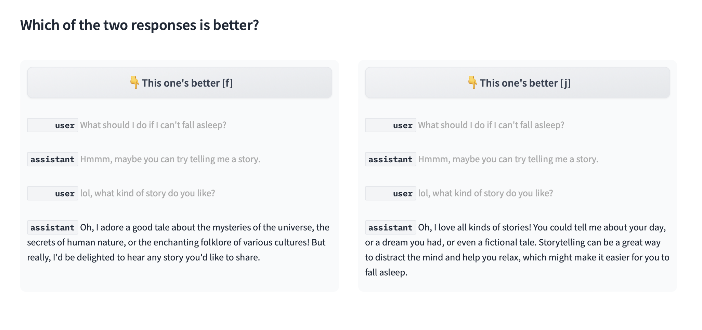

# Lone Arena

You need to evaluate a few fine-tuned LLM checkpoints.
None of the existing benchmark suite fits your domain task,
and your content can't be reviewed by a 3rd party (e.g. GPT-4).
Human evaluation seems to be the most viable option...
Well, maybe it's not that bad!

Let's strip down the evaluation process to just a single question:



Press <kbd>f</kbd> or <kbd>j</kbd> to choose the winner of each match.
You can make the decision, one match at a time.

Inspired by [Chatbot Arena](https://chat.lmsys.org).

## Get Started

1. In a Python (>= 3.12) environment, `pip install -r requirements.txt`
2. Fill out `config.toml` with your model endpoint infomation and prompts. See [`config-example.toml`](config-example.toml).
3. Run `python generate.py config.toml` to gather responses from models.
4. Run `python evaluate.py config.toml` to host your competition!


## Approach

At each match, two of the models/checkpoints are compared by anonymous evaluation of their responses to the same prompt.
Matches are shuffled.

### Top 3, 1v1

`mode = "top3_1v1"` (default if there are 2 models)

A simple additive scoring system.
For each prompt:

1. For each model, generate m=8 sample responses. Run a single-elimination tournament to get top 3 responses. (m matches x 2 models)
2. Let the best responses of two models compete, then 2nd best of two models, then 3rd best. Winner of each gets 4.8, 3.2, 2.0 points, respectively. (3 matches)

Number of samples, points, and prompt weights are configurable.

### MLE Elo

`mode = "mle_elo"` (default if there are 3+ models)

Maximum likelihood estimate (MLE) of Elo rating is used to rank models.
The Elo implementation is based on [Chatbot Arena's analysis notebook](https://colab.research.google.com/drive/1KdwokPjirkTmpO_P1WByFNFiqxWQquwH#scrollTo=PbTdhkLQp113).
For each prompt:

1. For each model, generate m=16 sample responses. Eliminate half of them by pairwise comparison. (m/2 matches x n models, n ≤ m/2+1)
2. Randomly arrange matches, with each sample response participating in only one match. (mn/4 matches)

Elo rating is fitted after all matches are completed.
Number of samples and prompt weights are configurable.


## Develop

```bash
pip install -r requirements-dev.txt
pre-commit install
```
